# Language Transfer Spanish Tutor 🇪🇸

An AI-powered Spanish tutor that runs inside your terminal. Built on the [Language Transfer](https://www.languagetransfer.org/) "Thinking Method" — no app, no API, just markdown files that turn any LLM agent into a patient, adaptive Spanish teacher.

> *"It's not about remembering — it's about knowing how to find it."*

## What Is This?

A collection of carefully crafted markdown files that give an AI agent the personality, teaching methodology, knowledge base, and memory system to tutor you in Spanish from A1 (absolute beginner) to C2 (near-native).

It works inside **Gemini CLI**, **Claude Code**, or any agent that reads workspace files.

## How It Works

The tutor doesn't lecture. It guides you to **discover** Spanish through questions — just like the Language Transfer audio course:

```
Teacher: "Preparation" in Spanish is "preparación."
         If you take off the "-tion" and add "-r"...
         what verb do you get?

Student: Preparar?

Teacher: Exactly. And "confirmation"?

Student: Confirmación... so "to confirm" is... confirmar?

Teacher: Now you'll never forget it.
```

Every concept is taught through **pattern discovery**, **block-by-block sentence building**, and **contextual etymology** — never through grammar tables or rote memorization.

## Quick Start

### Gemini CLI
```bash
cd Language-Transfer/
gemini
# Just say "let's start a lesson"
```

### Claude Code
```bash
cd Language-Transfer/
claude
# Just say "let's start a lesson" — CLAUDE.md auto-loads the tutor
```

The tutor will:
1. Assess your level through natural conversation (not a test)
2. Start teaching at your edge — where you know things but start to struggle
3. Remember everything across sessions via local markdown files

---

## Architecture: Static vs Dynamic Files

The most important design distinction. The workspace has two categories:

### Static Files — The Tutor's Brain (36 files, never change)

These define WHO the tutor is and WHAT it knows. Same for every student.

| File | Purpose |
|------|---------|
| `IDENTITY.md` | Name, version, purpose |
| `SOUL.md` | Personality & philosophy |
| `AGENT.md` | Teaching method, session flow, behavioral rules **(the heart)** |
| `GEMINI.md` | Auto-config + non-negotiable rules for Gemini CLI |
| `CLAUDE.md` | Auto-config + non-negotiable rules for Claude Code |
| `knowledge/concept-map.md` | A1→C2 topic index with prerequisites |
| `knowledge/teaching-method.md` | The 6 Language Transfer principles |
| `knowledge/teaching-examples.md` | 10 few-shot examples from the transcript |
| `knowledge/error-patterns.md` | Common mistakes by CEFR level |
| `knowledge/topics/*.md` (27 files) | Individual topic teaching guides, loaded on demand |

### Dynamic Files — The Learner's Journey (evolve with each session)

These track the individual student's progress. Start empty, grow over time.

| File | Purpose | How It Changes |
|------|---------|---------------|
| `LEARNER.md` | Student profile: level, interests, goals | Filled in during first session, refined over time |
| `memory/MEMORY.md` | Living progress tracker (~80 lines max) | Updated during and after every session |
| `memory/sessions/YYYYMMDD.md` | Individual session logs | New file created each session |

### How They Relate

```mermaid
flowchart LR
    A["🧠 Static Files\n36 files\nThe tutor's brain\nSame for every student"] -- reads --> B
    A -- writes --> B
    B["📝 Dynamic Files\nLEARNER.md + MEMORY.md + session logs\nThe student's journey\nUnique to each learner"]
```



Clone the repo → get the full tutor brain but a blank learner profile. The tutor assesses you fresh and builds your unique learning path.

---

## The Teaching Method

Built on the 6 Language Transfer principles:

| Principle | What It Means |
|-----------|--------------|
| **Pattern Discovery** | Never state rules — guide the student to notice patterns through examples |
| **Block-by-Block Building** | Complex sentences are built piece by piece, not presented whole |
| **Error as Compass** | Mistakes reveal thinking patterns — use them to teach, don't just correct |
| **Contextual Webs** | Connect words through etymology and meaning ("confirmar" = "con" + "firma") |
| **Adaptive Pacing** | Speed up when the student is nailing it, slow down when they're struggling |
| **Conversational Practice** | Real conversations, not drills — use the student's interests |

## Memory System

The tutor remembers you across sessions:

- **MEMORY.md** — compact profile: your level, solid concepts, shaky areas, recurring error patterns, what teaching approaches work for you
- **Session notes** — detailed logs of each lesson with specific errors, breakthroughs, and next-session suggestions
- **Error fingerprinting** — if you make the same mistake 3+ times, it becomes a tracked pattern the tutor actively works on
- **Student meta-feedback** — tell the tutor "too many hints" or "more conversation" and it adapts permanently

Memory saves happen **proactively during sessions**, not just at the end — so even if you close the terminal mid-lesson, your progress is preserved.

---

## Learnings: Building a Language Teaching Agent

### 1. LLMs Give Away Answers Compulsively
LLMs are trained to be helpful. A tutor must sometimes be *deliberately unhelpful*. We had to add explicit rules with BAD/GOOD examples showing what NOT to do.

### 2. LLMs Stack Questions
Instead of one question and waiting, the tutor asks 2-3 at once. Rule #1: "ONE question per message. Ask, then STOP."

### 3. Rules at the Bottom Get Ignored
Critical behavioral rules must go at the TOP of the first file the model reads. We moved them to `GEMINI.md` / `CLAUDE.md` as "NON-NEGOTIABLE RULES."

### 4. Model Quality Matters Enormously
Small models break character constantly. The tutor needs high instruction-following capability for Socratic restraint and patience.

### 5. Sessions End Without Warning
Users close terminals without saying goodbye. Memory must save incrementally during the session, not just at exit.

### 6. LLMs Get Stuck in Topic Loops
Once teaching subjunctive, it drills subjunctive forever. Topic rotation rule: switch after 5-6 exchanges, then circle back.

### 7. The Student Should Teach the Teacher
Students can give meta-feedback about teaching style. Methodology stays fixed; delivery adapts.

### 8. LLMs Write Like Documents, Not People
Markdown formatting in conversation feels robotic. Rule: "Write like a person talking, not a document."

**The paradox**: The hardest part isn't telling the agent what to teach. It's telling it what NOT to do. The agent already knew Spanish grammar. What it didn't know was when to shut up.

---

## Recommended Models

| Tier | Models | Notes |
|------|--------|-------|
| ⭐ Best | Gemini 3.1 Pro, Claude Opus 4.6, GPT-4o | Follow complex persona instructions faithfully |
| ✅ Good | Gemini 3 Flash, Claude Sonnet 4.6 | Solid balance of quality and speed |
| ⚠️ Will struggle | Flash Lite, Haiku, GPT-4o-mini | Too fast/cheap to maintain teaching discipline |

## Credits

- Teaching methodology inspired by [Language Transfer](https://www.languagetransfer.org/) by Mihalis Eleftheriou — a brilliant, free language course that teaches through guided discovery rather than memorization
- This project is an homage to [Mihalis's work](https://www.languagetransfer.org/about). If you enjoy this tutor, please support the original Language Transfer project
- The original Language Transfer courses (Spanish, French, Italian, German, Greek, Arabic, Turkish, Swahili, Music) are all free at [languagetransfer.org](https://www.languagetransfer.org/)

## License

MIT
